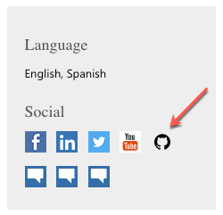
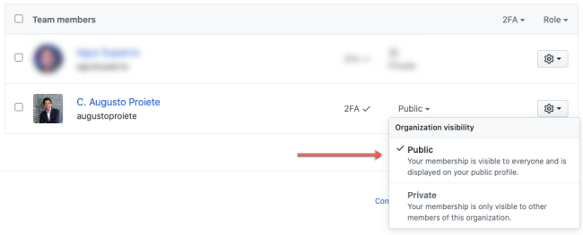

# How to join the Microsoft MVPs organization on GitHub

## Request to join

[Create an issue in this repository](https://github.com/msmvps/join-this-organization/issues) with a link to your Microsoft MVP profile on Microsoft's website, which you can find on [https://mvp.microsoft.com](https://mvp.microsoft.com]). The link should look something like:
``` 
https://mvp.microsoft.com/en-us/mvp/Your%20Name-9999999
```
or
```
https://mvp.microsoft.com/en-us/PublicProfile/9999999?fullName=Your%20Name
```

Make sure that the Microsoft MVP Profile contains a link to your GitHub profile.



You'll receive an e-mail with an invite to join the organization.

> The invite will be sent to the GitHub profile listed in the Microsoft MVP Profile.

## Publicize your organization membership

By default, once you accept the invite to join the organization, your membership will be marked as `private`, which means only you can see it.

Make sure you are logged into GitHub, go to [https://github.com/orgs/msmvps/people](https://github.com/orgs/msmvps/people) and locate your username in the list of members. If the list is large, you can search for your username in the search box.

In the menu to the right of your username, choose **Public** to publicize your membership.



---

_Disclaimer: This organization is maintained by current & former Microsoft MVPs and is not affiliated with or endorsed by Microsoft._
